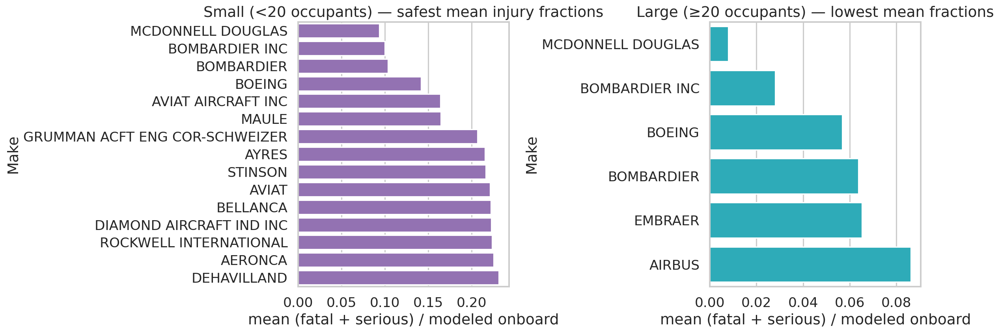
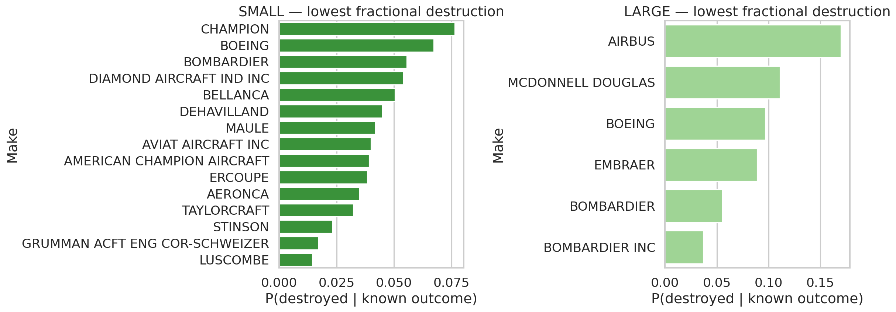
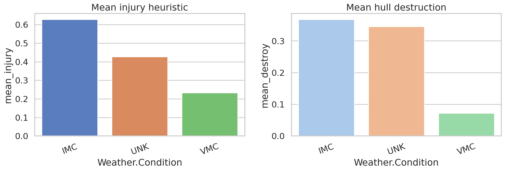
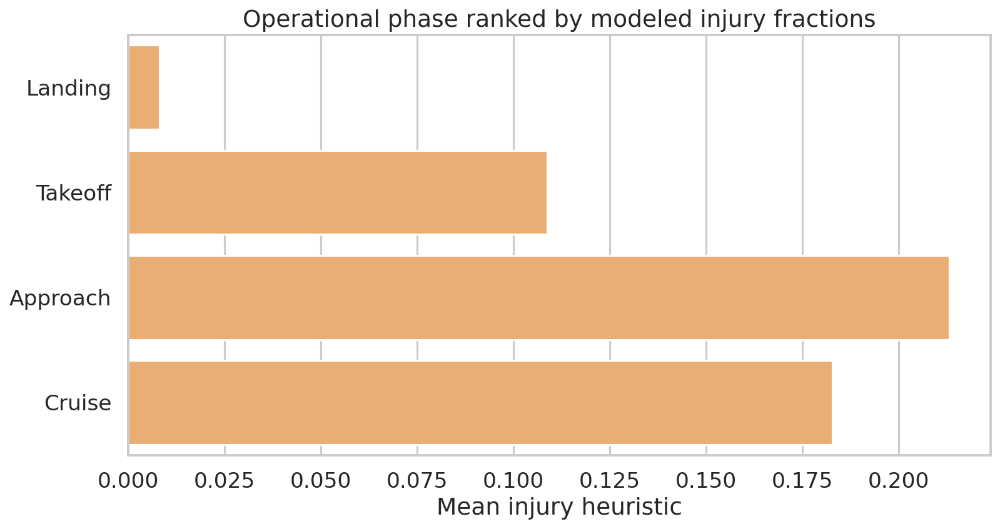
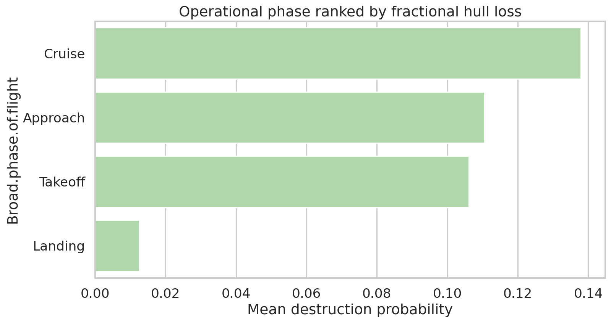

# Aviation accident safety lab

Short analysis for an **insurance-style client**: which fixed-wing, professionally built airplanes show **lower serious/fatal injury fractions** and **lower hull destruction** among **reported** accidents, and what **weather** / **flight phase** patterns show up in the same data.

---

## What’s in this repo

| Item | What it is |
| --- | --- |
| [`data/AviationData.csv`](data/AviationData.csv) | Raw NTSB/FAA-style extract |
| [`data/AviationData_cleaned.csv`](data/AviationData_cleaned.csv) | Rows + columns after filtering and feature work (~18k × 34) |
| [`Aviation_Accidents_Cleaning.ipynb`](Aviation_Accidents_Cleaning.ipynb) | Step 1 — clean and save the CSV |
| [`Aviation_Accidents_Data_Analysis.ipynb`](Aviation_Accidents_Data_Analysis.ipynb) | Step 2 — charts and writeups |
| [`figures/`](figures/) | PNG plots (some linked below) |

---

## Cleaning notebook

1. **Load** the CSV (tolerate odd characters so the file always loads).  
2. **Filter** to airplanes, not home-built, accidents from **1983 onward** (40-year window in the brief).  
3. **Build metrics**: total people from injury columns → **injury fraction** = (fatal + serious) / total; **destroyed** flag from damage text.  
4. **Clean Make/Model**: standard text, drop rare makes (under 50 rows), drop missing models, add **`plane_type` = Make + Model**.  
5. **Tidy** engine, weather, purpose, phase columns for later plots.  
6. **Drop** the two very empty columns the rubric targets (`Air.carrier`, `Schedule`).  
7. **Save** [`data/AviationData_cleaned.csv`](data/AviationData_cleaned.csv).

---

## Analysis notebook

1. **Load** the cleaned CSV.  
2. Split **small vs large** using **20+ people on board** ≈ large (from summed injury columns).  
3. **Makes**: top “best looking” means for injury; violin (small) / strip (large); lowest destruction rates—with a **minimum accident count** per make so tiny samples don’t dominate.  
4. **Plane types** (`plane_type`): same idea; only types with **at least 10** accidents in the slice.  
5. **Two factors**: **weather** and **phase of flight** vs injury and destruction.  
6. **Plots** are written under [`figures/`](figures/).

---

## Short results (see notebooks for numbers)

- **Large (20+ on board):** injury lists lean toward major transport OEM families; **always** cross-check **destruction** plots before picking a single “winner.”  
- **Small:** mix of trainers and light GA; destruction-friendly names often differ from injury-only leaders.  
- **Weather / phase:** worse average outcomes show up in **IMC/UNK** vs **VMC**, and in **takeoff/landing/approach**-type phases vs **cruise** (see figures).

---

## Key figures

**Makes — lowest mean injury fraction (small vs large panels)**  

**Makes — lowest destruction rate**  

**Weather vs injury and destruction**  

**Phase of flight vs injury**  

**Phase of flight vs destruction**  

---

## Limitations

- Only **accidents in the dataset** not “all flying hours.”  
- **Onboard counts** come from injury columns, not a passenger manifest.  
- Results are **associations**, not proof that weather or phase *caused* worse outcomes.
